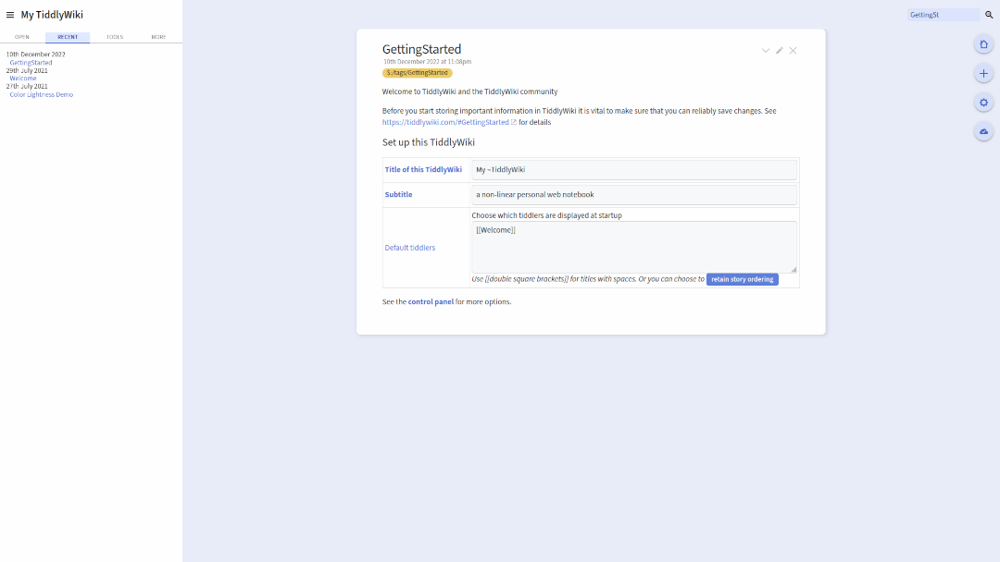
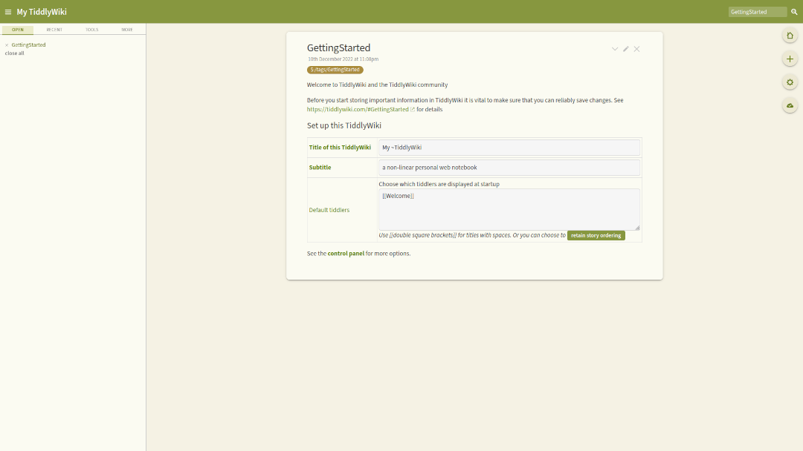

# Captivate

This is a TiddlyWiki theme that offers a left sidebar layout and easy color customization.

## Features

* Adds a pop of color to your wiki with just a few clicks. Pick any three colors and receive these variations of your color scheme: light, dark, and tan.
* Incorporates TiddlyWiki's layout switching mechanism. At a minimum, you can switch between the Captivate layout and the default TiddlyWiki layout by pressing <kbd>Ctrl</kbd>-<kbd>Shift</kbd>-<kbd>L</kbd>.
* Supports display-p3 color values and gracefully falls back to sRGB for browsers that do not support this color space.

## Demo

For a demonstration, visit [https://cdruan.github.io/tw5-captivate](https://cdruan.github.io/tw5-captivate)
